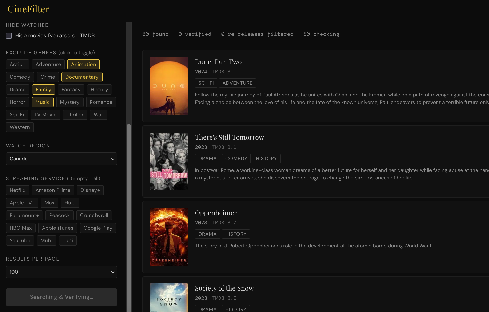

# CineFilter

**[Live Demo](https://ld100.github.io/cinefilter/)**



Movie discovery tool that solves the re-release date problem in TMDB.

Uses TMDB's Discover API for searching (genres, year range, streaming providers, rating threshold), then cross-verifies every result against OMDb (which serves actual IMDB data) to catch movies whose TMDB date was polluted by re-releases, Blu-ray editions, or digital distribution dates.

Movies that fail year verification are flagged and pushed to a separate "filtered out" section.

## The problem it solves

TMDB's `release_date` filter considers all release dates across all countries — theatrical, digital, DVD, TV re-releases. A 1994 film re-released on 4K Blu-ray in 2024 will appear when you search for 2024 movies. Even `primary_release_date` has edge cases. This tool catches those by checking the original year from IMDB via OMDb.

## Features

- **Year range filter** — uses `primary_release_date` on TMDB, then verifies against IMDB's original year
- **Genre exclusion** — toggle genres to exclude (e.g. Family, Animation)
- **Streaming provider filter** — filter by Netflix, Disney+, etc. (TMDB watch provider data powered by JustWatch)
- **Watch region** — streaming availability varies by country
- **Rating threshold** — TMDB pre-filter slider + optional post-verification IMDB cutoff slider
- **Minimum vote count** — skip obscure titles with few ratings
- **Hide watched movies** — connect your TMDB account to automatically filter out movies you've already rated (OAuth-like auth flow, session persisted in localStorage, rated IDs cached 1 hour)
- **Re-release detection** — movies whose IMDB year falls outside your range are visually flagged and separated
- **Configurable page size** — 10, 20, 50, or 100 results per page (multi-page TMDB fetching under the hood)
- **IMDB links** — movie titles link directly to their IMDB page
- **API key persistence** — keys stored in localStorage, clearable via UI
- **Loading skeletons** — shimmer placeholders while results load
- **Error boundaries & toasts** — graceful error handling with non-intrusive notifications
- **Accessibility** — ARIA attributes, keyboard navigation, screen reader support
- **API response caching** — in-memory cache (15 min TTL) avoids redundant API calls

## Tech stack

React 18 + Vite 6 + TypeScript (strict mode). CSS Modules. No server-side code.

Testing: Vitest + React Testing Library + jsdom. Linting: ESLint v9 + Prettier. Pre-commit hooks via Husky + lint-staged.

## Prerequisites

You need two free API keys:

| Service  | Get it at                                                              | Free tier                    |
| -------- | ---------------------------------------------------------------------- | ---------------------------- |
| **TMDB** | [themoviedb.org/settings/api](https://www.themoviedb.org/settings/api) | Unlimited (with attribution) |
| **OMDb** | [omdbapi.com/apikey.aspx](https://www.omdbapi.com/apikey.aspx)         | 1,000 requests/day           |

OMDb's free tier of 1,000 req/day means you can verify ~50 pages of results daily (20 movies/page x 2 API calls each = 40 calls/page for TMDB details + OMDb).

## Development

```bash
npm install
npm run dev
```

Opens at `http://localhost:5173/cinefilter/`.

### Other commands

```bash
npm run build          # production build -> dist/
npm run preview        # preview production build locally
npm run type-check     # TypeScript type checking
npm run lint           # ESLint check
npm run lint:fix       # ESLint auto-fix
npm run format         # Prettier format all files
npm run format:check   # Prettier check (CI)
npm test               # run tests (Vitest)
npm run test:watch     # run tests in watch mode
npm run test:coverage  # run tests with coverage report
```

## Deploy to GitHub Pages

### Option A: GitHub Actions (recommended)

1. Push to a GitHub repo
2. Go to **Settings -> Pages -> Source -> GitHub Actions**
3. The included `.github/workflows/deploy.yml` handles it on every push to `master` or `main`

The CI pipeline runs type-check, lint, format check, and tests before building.

**Important:** If your repo name is not `cinefilter`, update the `base` value in `vite.config.ts`:

```ts
base: "/your-repo-name/",
```

### Option B: Manual deploy

```bash
npm run deploy
```

Uses `gh-pages` package to push `dist/` to `gh-pages` branch.

## Architecture

```
src/
├── types/
│   └── index.ts           Central type definitions
├── constants/
│   └── index.ts           Genres, providers, regions, page sizes, defaults
├── services/
│   ├── tmdb.ts            TMDB API client (discover, movie details)
│   ├── omdb.ts            OMDb API client (year/rating lookup)
│   ├── tmdbAuth.ts        TMDB authentication (3-step OAuth-like flow + rated movies)
│   ├── cache.ts           In-memory API response cache (15 min TTL)
│   └── movieLogic.ts      Pure business logic (enrichment, categorization)
├── hooks/
│   ├── useMovieSearch.ts  Orchestrates TMDB search + OMDb verification
│   ├── useTmdbSession.ts  TMDB auth lifecycle + rated movie ID management
│   ├── useDebounce.ts     Generic debounce hook (400ms)
│   └── useToast.ts        Toast notification state
├── components/            UI components (each with co-located .module.css)
│   ├── App.tsx            Root: API keys, filters, pagination, orchestration
│   ├── FilterPanel.tsx    Sidebar filter controls with debounced inputs
│   ├── MovieCard.tsx      Single movie result with verification badge
│   ├── MovieCardSkeleton.tsx  Shimmer loading skeleton
│   ├── MultiSelect.tsx    Reusable toggle-chip selector
│   ├── RatingSlider.tsx   Range slider with numeric display
│   ├── Pagination.tsx     Page navigation controls
│   ├── ApiKeySetup.tsx    Initial API key entry form
│   ├── ErrorBoundary.tsx  React error boundary
│   └── Toast.tsx          Fixed-position toast notifications
├── test/
│   ├── setup.ts           Test setup (jest-dom + global fetch guard)
│   └── fixtures.ts        Shared mock data
└── main.tsx               Entry point (wraps App with ErrorBoundary)
```

**Data flow:** FilterPanel -> useMovieSearch -> TMDB discover (multi-page) -> per-movie TMDB details (IMDB ID + streaming) -> OMDb verification -> categorizeMovies (watched / mismatch / belowCutoff / visible) -> MovieCard with status badge.

Verification is sequential (not parallel) to stay within OMDb's rate limits on the free tier.

## TMDB "Hide Watched" integration

Checking "Hide movies I've rated on TMDB" triggers a 3-step auth flow:

1. App requests a temporary token from TMDB
2. User approves the token on themoviedb.org (opens in a new tab)
3. User clicks "I've approved it" — app exchanges the token for a session

The session is stored in localStorage and persists across visits. On each search, the app fetches all movie IDs the user has rated on TMDB (paginated, cached for 1 hour in localStorage) and moves those movies to a separate "Already watched" section instead of hiding them entirely.

Disconnect at any time via the "Disconnect TMDB" link in the filter panel.

## Known limitations

- The TMDB pre-filter uses TMDB's `vote_average`, not IMDB ratings. The IMDB cutoff slider applies post-verification only.
- OMDb free tier is 1,000 req/day. Heavy use may exhaust it.
- Streaming provider list is hardcoded to common services. TMDB has hundreds more — extend `PROVIDERS` in `src/constants/index.ts`.
- Watch region affects which streaming providers are shown, not which movies are returned (unless you also filter by provider).
- "Hide Watched" relies on TMDB ratings as a proxy for "watched". If you watched a movie without rating it on TMDB, it won't be filtered.

## License

MIT
